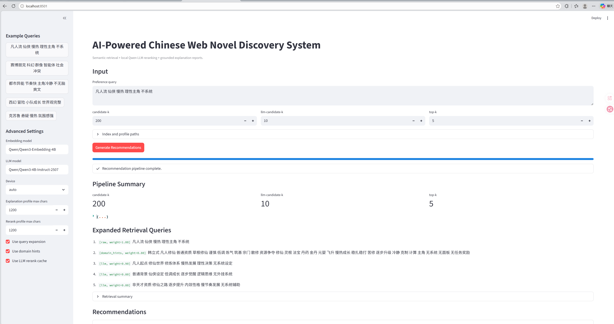
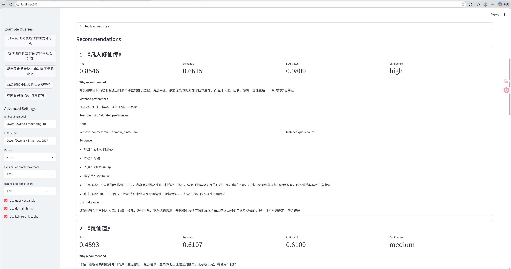

# AI-Powered Chinese Web Novel Discovery System

## Overview

This project is a local AI application that turns a private corpus of 7,666 Chinese web novels in TXT format, around 36 GB total, into a searchable and explainable recommendation system. It is designed for personal web novel discovery over messy, unstructured local text data.

The system supports natural-language Chinese preference queries such as:

```text
凡人流 仙侠 慢热 理性主角 不系统
```

Instead of relying on manually provided tags or collaborative-filtering user behavior, the system combines semantic embeddings, FAISS vector retrieval, query expansion, local Qwen3 LLM reranking, and grounded explanation generation. It is an AI application development portfolio project demonstrating data processing, Chinese NLP, vector search, local LLM inference, recommendation ranking, testing, CLI tooling, and Streamlit demo integration.

## Demo

Streamlit demo interface:



Explainable recommendation cards:



## Key Features

- Large-scale TXT corpus ingestion: scans thousands of Chinese novel TXT files and builds structured metadata.
- Encoding detection and text cleaning: handles Chinese encodings and removes repeated source-site boilerplate such as `知轩藏书` / `zxcs` advertisements.
- Compact novel profile generation: creates representative profiles from sampled novel text instead of embedding full books directly.
- Qwen3 semantic embeddings: uses `Qwen/Qwen3-Embedding-4B` to encode novel profiles for semantic retrieval.
- FAISS vector search: retrieves candidate novels from the local corpus using natural-language queries.
- Query expansion and multi-query retrieval: improves recall for high-level genre and trope queries.
- Local LLM-assisted reranking: uses a local Qwen3 LLM through Hugging Face Transformers to evaluate candidate-query fit.
- Grounded recommendation explanations: explains recommendations using retrieved profile evidence and ranking signals.
- Streamlit demo app: provides an interactive interface for natural-language search and recommendation.
- Privacy-preserving local inference: runs locally without sending the private novel corpus to external APIs.

## Example Use Case

User query:

```text
凡人流 仙侠 慢热 理性主角 不系统
```

System process:

```text
query
-> query expansion
-> Qwen3 embedding retrieval
-> FAISS candidate search
-> local Qwen3 LLM reranking
-> grounded explanation report
```

The output is a ranked list of candidate novels with semantic score, LLM match score, confidence, matched preferences, possible risks, evidence snippets, and a concise user-facing explanation. Results depend on the local corpus and the cleaned compact profiles generated from sampled text.

## System Architecture

```text
Raw TXT novels
    ↓
Encoding detection + text cleaning
    ↓
Novel profile generation
    ↓
Qwen3-Embedding-4B embeddings
    ↓
FAISS vector index
    ↓
Natural-language query
    ↓
Query expansion + multi-query retrieval
    ↓
Local Qwen3 LLM reranking
    ↓
Grounded recommendation explanation
    ↓
Streamlit demo / CLI output
```

## Technical Stack

- Python 3.11
- uv
- pandas / pyarrow
- Hugging Face Transformers
- Qwen3-Embedding-4B
- local Qwen3 LLM
- FAISS
- Streamlit
- pytest

## Project Stages

1. Stage 1: Dataset inventory scans raw TXT files, detects encoding, extracts metadata, and writes `data/processed/novels.parquet`.
2. Stage 2: Text cleaning and novel profile generation removes source-site boilerplate, samples representative text, and writes `data/processed/novel_profiles.parquet`.
3. Stage 3: Embedding generation and FAISS index building embeds compact profiles with Qwen3-Embedding-4B and writes the local vector index.
4. Stage 4: LLM-assisted recommendation reranking retrieves candidates with FAISS, expands queries for recall, and reranks candidates with local Qwen3 scoring.
5. Stage 5: Grounded explanation/report generation turns final ranked candidates into readable recommendation reports without changing rank order.
6. Stage 6: Streamlit demo app provides an interactive UI for natural-language queries, recommendation cards, progress display, and report export.


## Quick Start

Install dependencies:

```bash
uv sync
```

Place raw TXT novels under:

```text
data/raw/
```

Build the inventory:

```bash
uv run python scripts/01_inventory.py --overwrite
```

Build cleaned compact profiles:

```bash
uv run python scripts/02_build_profiles.py --overwrite
```

Build embeddings and FAISS index:

```bash
uv run python scripts/03_build_index.py --overwrite --device cuda
```

Run semantic search:

```bash
uv run python scripts/04_search_demo.py "凡人流 仙侠 慢热 理性主角 不系统" --device cuda
```

Run LLM-assisted recommendations:

```bash
uv run python scripts/05_recommend_demo.py "凡人流 仙侠 慢热 理性主角 不系统" --use-query-expansion --use-domain-hints --candidate-k 200 --top-k-per-query 100 --llm-candidate-k 10 --top-k 10 --device cuda
```

Generate an explanation report:

```bash
uv run python scripts/06_explain_demo.py "凡人流 仙侠 慢热 理性主角 不系统" --candidate-k 200 --llm-candidate-k 10 --top-k 5 --device cuda
```

Run the Streamlit demo app:

```bash
uv run streamlit run src/streamlit_app.py
```

For faster testing in the app, use:

- `candidate-k = 50`
- `llm-candidate-k = 3`
- `top-k = 3`

For better recommendation quality, use:

- `candidate-k = 200`
- `llm-candidate-k = 10`
- `top-k = 5`

## Stage Details

### Stage 1: Dataset Inventory

```bash
uv run python scripts/01_inventory.py --overwrite
```

Scans `data/raw/`, detects encodings, extracts file metadata, estimates chapter counts, and writes `data/processed/novels.parquet`.

### Stage 2: Cleaned Novel Profiles

```bash
uv run python scripts/02_build_profiles.py --overwrite
```

TXT web novels often contain repeated source-site boilerplate at the beginning or ending. The Stage 2 cleaner removes `知轩藏书`, `zxcs8.com`, `更多精校小说`, and related advertisement/watermark lines before chapter splitting, sampling, and profile generation. This improves embedding quality because repeated boilerplate creates meaningless semantic similarity across unrelated books.

After profile cleaning is verified, rebuild the FAISS index:

```bash
uv run python scripts/03_build_index.py --overwrite --device cuda
```

| Metric | Value |
|------|------|
| Profiles written | 7,655 / 7,666 |
| Rate | 99.86% |
| boilerplate detected | 7,575 |
| boilerplate lines removed | 45,380  |
| Avg profile chars | 2,014  |
| Avg chapter count | 796  |

### Stage 3: Embeddings and FAISS Index

Stage 3 embeds compact profiles with `Qwen/Qwen3-Embedding-4B` and builds a FAISS `IndexFlatIP` index.

Expected files:

- `data/index/faiss.index`
- `data/index/novel_id_map.json`
- `data/index/index_metadata.json`

| Metric           |                                                        Value |
| ---------------- | -------------------------------------------------------------|
| Profiles loaded  |                                                         7655 |
| Profiles skipped |                                                            0 |
| Embedding shape  |                                                 (7655, 2560) |
| Device           |                                                     RTX 4080 |
| FAISS index size |                                                         7655 |
| Runtime          |                                                ~14.47 hours  |
| Processing speed |                                         8.8 seconds/profile  |


### Stage 4: Query Expansion and Local LLM Reranking

Domain hints are used only for retrieval expansion, not final scoring. Final ranking is based on semantic retrieval signals, local LLM match score, confidence, and risk penalties.

Stage 4 uses diversified LLM candidate selection so strong recall candidates are not skipped just because they appear lower in the merged retrieval order. The selector chooses candidates from multiple priority views:

- top candidates by merged `retrieval_score`
- top candidates by semantic score
- top candidates by `best_faiss_rank`
- optional `--debug-target-title` inclusion for diagnosis

Each selected candidate includes `llm_selection_reasons`, such as `retrieval_score_top`, `semantic_score_top`, or `best_faiss_rank_top`. The CLI table displays these reasons alongside `selected_for_llm`, `best_faiss_rank`, semantic score, matched query count, and retrieval sources.

Current Stage 4 scoring:

```text
final_score =
0.40 * normalized_semantic_score
+ 0.50 * llm_match_score
+ 0.10 * confidence_score
- risk_penalty
```

Candidates that are not sent to the LLM receive a semantic fallback score:

```text
fallback_final_score =
0.35 * normalized_semantic_score
+ 0.05 * matched_query_count_bonus
```

This keeps high-quality semantic candidates visible while still giving priority to strong LLM-scored matches.

### Stage 5: Explanation and Recommendation Report

Stage 4 decides ranking. Stage 5 explains that ranking. The explanation LLM uses only Stage 4 outputs and sampled profile evidence. It does not change ranking. If JSON parsing fails, the system uses a deterministic fallback explanation.

Save a report:

```bash
uv run python scripts/06_explain_demo.py "凡人流 仙侠 慢热 理性主角 不系统" --candidate-k 200 --llm-candidate-k 10 --top-k 5 --save-report reports/fanren_xianxia.md --device cuda
```

### Stage 6: Streamlit Demo App

The app uses the existing FAISS index, id map, and novel profiles. It does not rebuild the index, regenerate embeddings, or reclean text.

The app demonstrates:

- Natural-language Chinese preference input
- Query expansion and multi-query FAISS retrieval
- Local Qwen LLM-assisted reranking
- Grounded explanation generation
- Recommendation cards with scores, evidence, risks, and takeaway
- Markdown and JSON report export

First run can be slow because local Hugging Face models are loaded into GPU memory. Later button clicks should be faster because Streamlit caches the embedding model, local Qwen LLM, FAISS index, id map, and profile lookup.


## Evaluation

The system is evaluated with manually designed preference queries in `eval/eval_queries.jsonl`. Because the private corpus has no official relevance labels or genre annotations, evaluation combines lightweight automatic anchor checks with optional manual judgement.

The main comparison is:

- `baseline_faiss`: FAISS-only semantic retrieval from the raw query.
- `full_llm_rerank`: query expansion, multi-query FAISS retrieval, and local Qwen3 LLM reranking.

Automatic metrics include `Anchor Hit@K`, `Anchor Recall@K`, and average first anchor rank when optional `anchor_titles` are provided. Manual judgement metrics include `Precision@K`, strong `Precision@K`, average relevance score, and constraint violation rate. These metrics are intended to compare system variants and diagnose failure cases, not to claim objective benchmark performance.

Baseline-only quick evaluation:

```bash
uv run python scripts/07_evaluate.py --mode baseline --top-k 10 --candidate-k 100
```

Full evaluation:

```bash
uv run python scripts/07_evaluate.py --mode both --top-k 10 --candidate-k 100 --llm-candidate-k 10
```

Manual metric calculation after filling `eval/manual_judgements.csv`:

```bash
uv run python scripts/08_eval_metrics.py --judgements eval/manual_judgements.csv --k 10
```

See [docs/evaluation.md](docs/evaluation.md) for the dataset format, judgement template, metrics, and limitations.


## Data and Model Notes

- Raw TXT files are not included in the repository.
- Generated processed data and FAISS indexes are not included unless explicitly small/sample files are provided.
- Hugging Face model weights are downloaded to the local Hugging Face cache.
- The corpus is private/personal and should be placed under `data/raw/` locally.
- All LLM usage is local through Hugging Face Transformers.

## Limitations

- Recommendations depend on sampled compact profiles, not full human-level reading of entire novels.
- Current profile quality affects retrieval and recommendation quality.
- Local LLM reranking and explanation can be time-consuming.
- The system does not yet use collaborative filtering or supervised user behavior training.
- Genre and trope understanding are inferred from sampled text and LLM analysis, not from official labels.
- Rebuilding embeddings and the FAISS index can take a long time on the full 36 GB corpus.
- This is a local demo application, not a production deployment.
